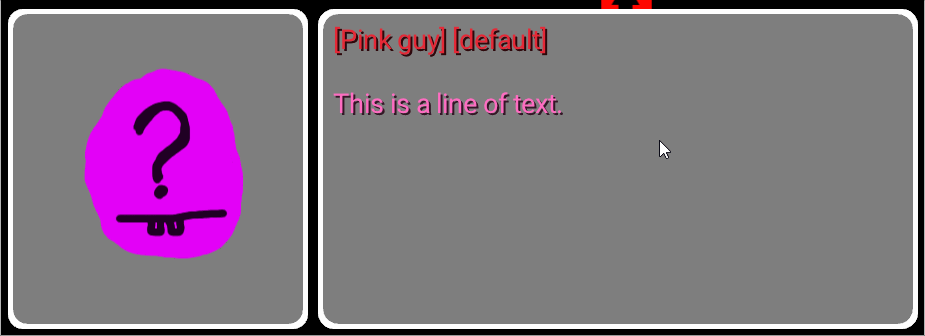

# Who stole the sun?

Unfinished isometric adventure game. The game's engine was almost complete. We had a pretty cool dialog system. The dialog below was produced by this [script file](res/example-script.txt) used for testing.

  

The script system syntax was designed to be easy to use but very powerful.
| syntax       | meaning                                                  |
| ------------ | -------------------------------------------------------- |
| (empty line) | start a new paragraph                                    |
| `` ` ``      | short invisible pause                                    |
| `∣group∣`     | show the entire word at once instead of letter-by-letter |
| `*bold*`     | **bold** text                                            |
| `_italic_`   | _italic_ text                                            |
| `[NPC Name]` | switches the active NPC                                  |
| `[portrait]` | switches between the active NPC's portraits              |
| `{command}`  | execute commands (screen shake, sound effects, etc)      |

## Editor controls

- `F1` Toggles editor mode. 
- `RIGHT-CLICK + DRAG` Moves the camera.
- `SCROLL` Zooms in and out.
- `C` Center the camera on the player and reset zoom.
- `CTRL/COMMAND + S` Save the scene.
- `CTRL/COMMAND + R` Reload the scene.
- In the _Objects_ tab
	- `LEFT-CLICK` Selects an object.
	- `LEFT-CLICK + DRAG` Move the selected object.
	- `CTRL/COMMAND + D` Deselects object.
	- `DELETE` Deletes the selected object.
	- `CTRL/COMMAND + G` Toggle snap to grid.
- In the _Stairs_ tab
	- `LEFT-CLICK + DRAG` Create a stair.
	- `LEFT-CLICK stair` Increase elevation.
	- `RIGHT-CLICK stair` Decrease elevation.
	- `DELETE/BACKSPACE` Delete hovered stair.
